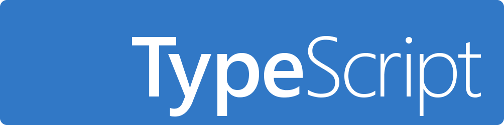

<h1 align="center">
      My first TypeScript project
      
</h1>

## About
 A simple application in which I learned about TypeScript and practiced typing components, objects, and functions, etc.
 Link to view this  App &#10143;  https://kirlarionov.github.io/type-script-1project/

## Technology stack

  
  
  
  
  
  

### Developers:
[Kirill Larionov (GitHub)](https://github.com/kirlarionov)
___
##### [
Back to top &#129145;
](#anchor)

